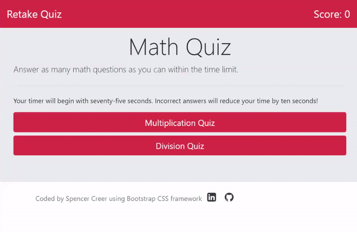

# Math Quiz


## Description
Timed mathematics quiz.

This application presents the user with a timed mathematics quiz and stores the user's initials and score to local storage.

The user may choose between a multiplication or division mathematics quiz as well as the difficulty. The quiz starts with a seventy-five-second timer randomly selects a mathematics question. If the user enters the answer, then a new question is displayed. If the user entry is incorrect, then ten seconds are subtracted from the quiz time.

The quiz ends when the timer runs out. The user may then enter their initials. When the user clicks submit, the initials and score are stored in local storage and the top scores are displayed in a table. The user may clear the scores list by clicking the "Clear Highscores" button.

## Table of Contents
* [Links](#links)
* [Animation](#animation) 
* [Installation](#installation)
* [Dependencies](#dependencies)
* [Technologies](#technologies)  
* [License](#license)
* [Contact](#contact)

## Links
Published URL: [https://spencercreer.github.io/math_quiz/](https://spencercreer.github.io/math_quiz/)

Repository: [https://github.com/spencercreer/math_quiz](https://github.com/spencercreer/math_quiz)

## Animation
The following animation demonstrates the application functionality:


## Installation
This application utilizes the following [dependencies](#dependencies).

After cloning the repo, install the necessary dependencies by running the following command:

  ```
  npm install
  ```
This application is setup to use MySQL database management system. If you do not have MySQL installed, you may install it [here](https://dev.mysql.com/downloads/mysql/).
Once you have MySQL installed, you will need to create a .env file with the following credentials:
  ```
  DB_NAME=math_quiz_db
  DB_USER=<mysql user>
  PASSWORD=<user password>
  ```
Set up the your local database by logging into MySQL in a terminal window and running the schema.sql file.
  ```
  mysql -u <user> -p <password>
  SOURCE db/schema.sql
  ```
You may seed your MySQL database with test data by running:
  ```
  npm run seeds
  ```
Once your local database is setup, you may start the application by running:
  ```
  npm start
  ```

## Dependencies

## Contribute
Please submit a PR if you would like to contribute.

## Technologies
 * JavaScript
 * HTML
 * Bootstrap

## License
This project is licensed under the MIT license.

## Contact
For questions or comments, please contact me.

Email: <a href="mailto: spencercreer@gmail.com" target="_blank">spencercreer@gmail.com</a>

GitHub: [spencercreer](https://github.com/spencercreer/)
